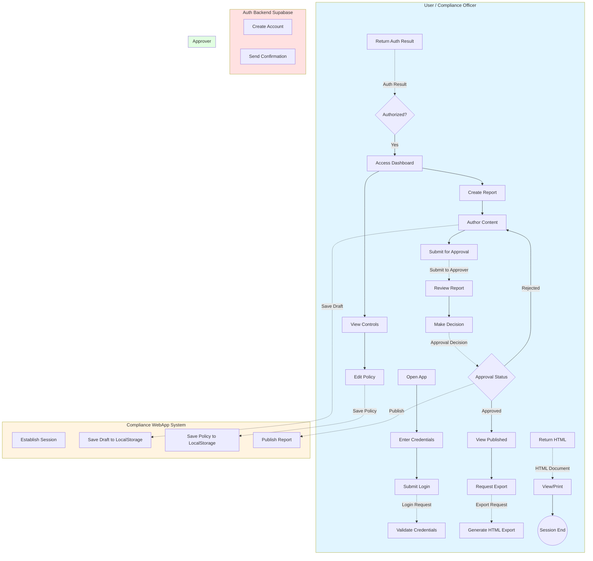
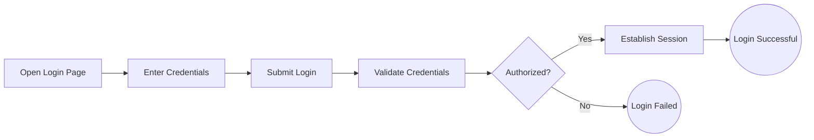
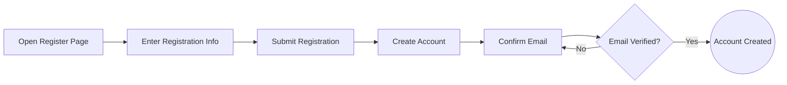
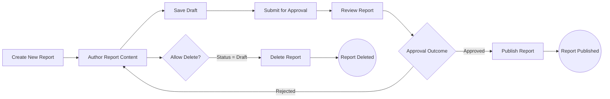
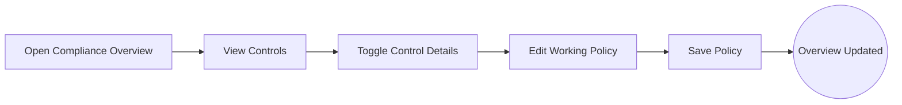
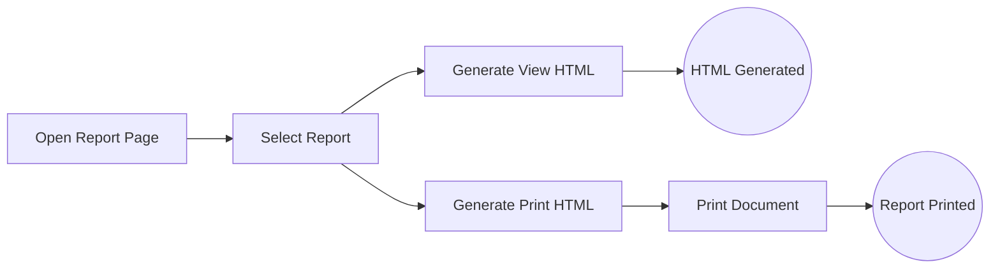

# Compliance Project Process Diagrams (Mermaid Quick View)

## Complete System Collaboration Diagram

## User Authentication

## User Registration

## GDPR Report Lifecycle

## Compliance Overview Management

## Report Export and Print

> Note: Mermaid is for quick visualization; BPMN XML files under `xml/` are canonical.
