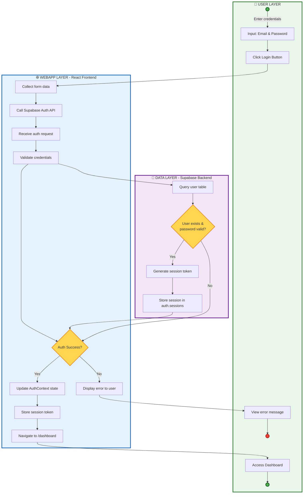

# Authentication Flow

This diagram shows the three-layer architecture: User, WebApp, and Data.

## Flow Description

1. **User enters credentials** - User provides email and password on login page
2. **WebApp sends credentials to Supabase** - Frontend submits authentication request
3. **Supabase validates credentials** - Backend verifies user identity
4. **Credentials valid?** - Decision point based on validation result
   - **Yes Path:**
     - Session created by Supabase
     - AuthContext updates UI state
     - User redirected to Dashboard
   - **No Path:**
     - Error message displayed to user

## Components Involved

- **User**: Initiates login process
- **WebApp**: React frontend application
- **Supabase**: Authentication backend service
- **AuthContext**: React context managing authentication state
