# Complete System Architecture - BPMN Style

This diagram shows the complete workflow with proper BPMN swimlane structure matching the three-layer architecture.

```mermaid
graph LR
    subgraph USER[" USER "]
        direction LR
        Start((Start)) --> U1[Open Web App]
        U1 --> U2[Enter Email + Password]
        U2 --> U3[Submit Credentials]
        U3 --> U4[Open GDPR Workspace]
        U4 --> U5[Edit Policy Text]
        U5 --> U6[Click Save Policy]
        U6 --> End((Policy Saved))
    end
    
    subgraph WEBAPP[" WEBAPP "]
        direction LR
        W1[Receive Credentials]
        W2[Send to Supabase]
        W3{Login Successful?}
        W4[Show Error Message]
        W5[Load GDPR Structure + Options]
        W6[Save Draft to LocalStorage]
        W7[Send Policy to Supabase]
        W8[Update Version List]
        
        U3 -.-> W1
        W1 --> W2
        W2 --> W3
        W3 -->|No| W4
        W3 -->|Yes| W5
        W5 -.-> U4
        U5 -.-> W6
        U6 -.-> W7
        W7 --> W8
        W8 -.-> End
    end
    
    subgraph SUPABASE[" SUPABASE "]
        direction LR
        D1[Validate Credentials]
        D2[Return Auth Result]
        D3[Return GDPR Data]
        D4[Store Policy Version]
        
        W2 -.-> D1
        D1 --> D2
        D2 -.-> W3
        W5 -.-> D3
        D3 -.-> W5
        W7 -.-> D4
        D4 -.-> W8
    end
    
    style USER fill:#E8F5E9,stroke:#2E7D32,stroke-width:3px
    style WEBAPP fill:#E3F2FD,stroke:#1565C0,stroke-width:3px
    style SUPABASE fill:#F3E5F5,stroke:#6A1B9A,stroke-width:3px
    
    style Start fill:#4CAF50,stroke:#1B5E20,stroke-width:3px
    style End fill:#4CAF50,stroke:#1B5E20,stroke-width:3px
    style W3 fill:#FFD54F,stroke:#F57F17,stroke-width:2px
    style W4 fill:#EF5350,stroke:#C62828,stroke-width:2px
    style W6 fill:#FF9800,stroke:#E65100,stroke-width:2px
    style D4 fill:#CE93D8,stroke:#6A1B9A,stroke-width:2px
```

## Diagram Forklaring

### **Swimlanes (Tre Lag)**

1. **USER** (Grøn) - Brugerens handlinger
2. **WEBAPP** (Blå) - React frontend logik
3. **SUPABASE** (Lila) - Backend database

### **Flow Beskrivelse**

#### **Authentication Flow**
- User: Enter credentials → Submit
- WebApp: Receive → Send to Supabase → Decision gateway
- Supabase: Validate → Return result

#### **Policy Creation Flow**
- User: Open workspace → Edit text → Save
- WebApp: Load structure → Auto-save to LocalStorage → Send to Supabase
- Supabase: Return GDPR data → Store version

### **BPMN Elementer**

- **Circle** `(( ))` - Start/End events
- **Box** `[ ]` - Tasks/Activities
- **Diamond** `{ }` - Gateways (decisions)
- **Solid arrows** `-->` - Process flow
- **Dotted arrows** `-.->` - Message/data flow mellem layers

### **Data Flow Pattern**

- **Horisontal flow** inden for hver swimlane viser procesforløbet
- **Vertikal dotted lines** viser kommunikation mellem lagene
- **LocalStorage** håndteres i WebApp laget
- **Database operationer** i Supabase laget

## Architecture Overview

### **👤 USER LAYER**
All user interactions across three main workflows:
- **Authentication**: Login process
- **Policy Management**: Creating and editing GDPR policies
- **Report Workflow**: Compiling, approving, and printing reports

### **🌐 WEBAPP LAYER** (React Frontend)
Three main modules handle business logic:

#### **Authentication Module**
- Collects user credentials
- Communicates with Supabase Auth
- Manages AuthContext state
- Handles navigation

#### **Policy Management Module**
- Loads policy templates
- Provides rich text editor
- Auto-saves drafts to LocalStorage
- Creates versioned records
- Updates version history UI

#### **Report Module**
- Generates report HTML from policies
- Creates draft entries
- Manages approval workflow
- Locks approved reports
- Generates PDF exports

### **💾 DATA LAYER** (Supabase + LocalStorage)

#### **Authentication Service**
- `auth.users` - User accounts
- `auth.sessions` - Active sessions
- Credential validation
- Token generation

#### **Policy Database**
- `gdpr_activities` - Policy templates and structures
- `policy_versions` - Versioned policy records

#### **Report Database**
- `reports` - Draft, approved, and published reports
- Status management (draft → approved → published)
- Locking mechanism for approved reports

#### **LocalStorage**
- `gdpr_drafts` - Temporary policy drafts for speed
- `session_token` - Authentication session persistence

## Data Flow Patterns

1. **Solid lines** (→): Synchronous data flow
2. **Dotted lines** (-.->): Asynchronous/auto-save operations
3. **Databases** (cylinder shapes): Persistent storage
4. **Boxes**: Processing tasks and UI components

## Key Features

- **Three-tier architecture**: Clean separation of concerns
- **Dual storage strategy**: LocalStorage for speed, Supabase for persistence
- **Role-based workflows**: User and Approver roles
- **Versioned data**: Policy versions tracked in database
- **Stateful sessions**: Authentication state managed across layers
