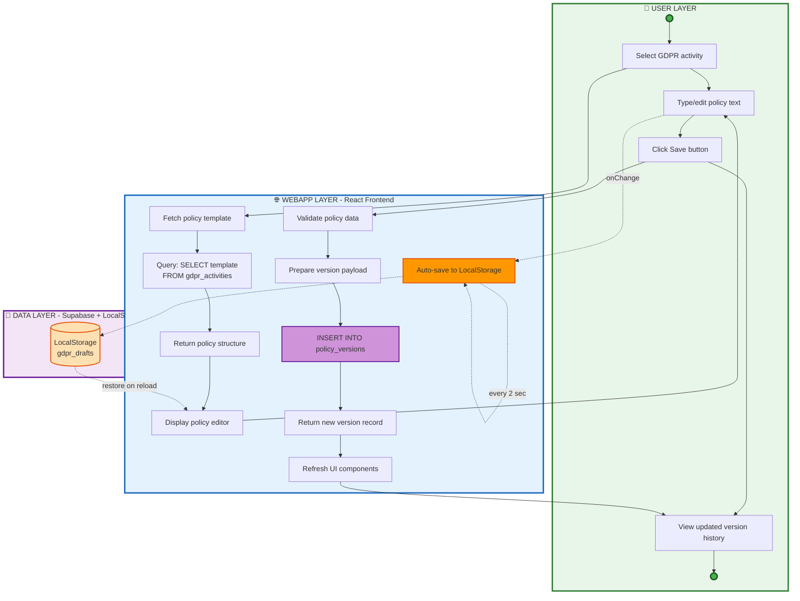

# Policy Creation Flow

This diagram shows the three-layer architecture: User, WebApp, and Data.

## Flow Description

1. **User selects GDPR activity** - User chooses which compliance area to work on
2. **System loads structure from Supabase** - Pre-defined policy template/structure loaded
3. **User edits text** - User customizes policy content
4. **Draft saved in LocalStorage** - Auto-save for performance and offline capability
5. **User saves policy** - User explicitly commits changes
6. **Create version in database** - New version stored in Supabase
7. **UI updates version history** - Interface shows new version in history list

## Storage Strategy

- **LocalStorage**: Fast, temporary drafts for editing performance
- **Supabase Database**: Permanent, versioned policy storage

## Components Involved

- **User**: Creates and edits policy content
- **WebApp**: Manages UI and local storage
- **Supabase**: Stores policy structures and versions
- **LocalStorage**: Temporary draft storage
