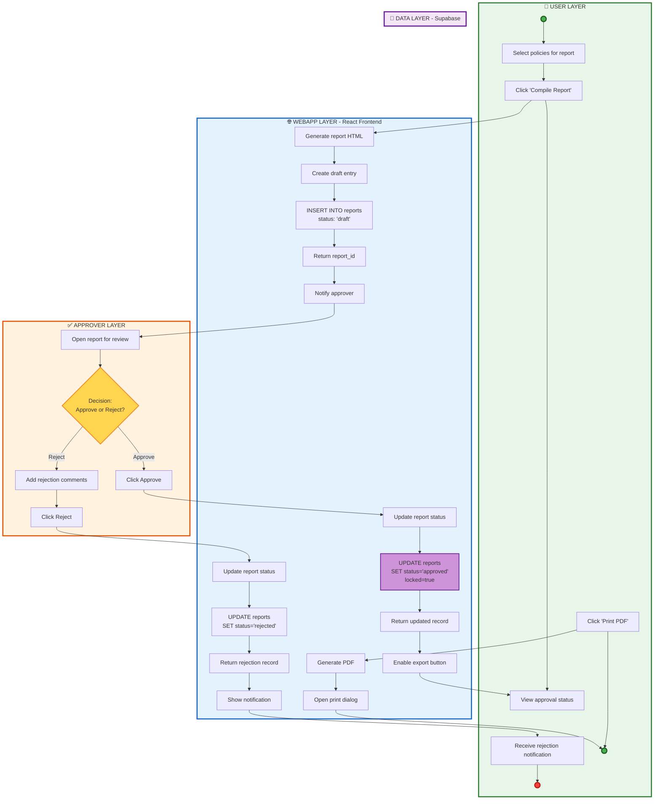

# Report Workflow

This diagram shows the three-layer architecture with an additional Approver layer.

## Flow Description

1. **User compiles report** - User selects existing policy versions to include
2. **System creates draft report** - WebApp generates draft from selected policies
3. **Approver reviews report** - Designated approver examines content
4. **Approved?** - Decision point for approval
   - **Yes Path:**
     - Report is locked (no further edits)
     - Report becomes exportable
     - User can print PDF via browser
     - Report marked as published
   - **No Path:**
     - Approver rejects with feedback
     - User is notified of rejection

## Report States

- **Draft**: Editable, not approved
- **Approved**: Locked, exportable
- **Published**: Final, locked, exportable

## Components Involved

- **User**: Compiles reports and exports PDFs
- **Approver**: Reviews and approves/rejects reports
- **WebApp**: Manages report lifecycle and PDF generation
- **Supabase**: Stores report data and approval status
